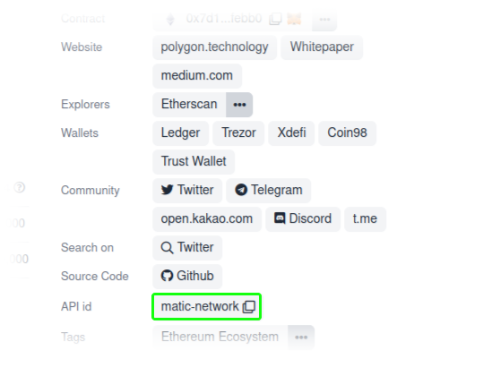

import BadgesBanner from "../../components/BadgesBanner.js"
import Connect from "../../components/examples/Connect.js"
import AddZRXToken from "../../components/examples/AddZRXToken.js"
import EtherPrice from "../../components/examples/EtherPrice.js"

# useMetamask

An utility React hook to handle Metamask's browser API

<BadgesBanner />

## Installing

```bash
npm i @forta/usemetamask
```

## Basic usage

```jsx
import { useMetamask } from "@forta/usemetamask"

function Connect() {
  const { account, connect, balance, formattedBalance, error } = useMetamask()
  return (
    <>
      <code>Address: {account || "null"}</code>
      <code>Balance: {balance} ETH</code>
      <code>FormattedBalance: {formattedBalance} ETH</code>
      <code>Error: {error ? error.message : "null"}</code>
      <button onClick={connect}>CONNECT</button>
    </>
  )
}
```

<Connect />

## Send transaction

```jsx
import { parse, useMetamask } from "@forta/usemetamask"
// ..

const { send } = useMetamask()
send({
  to: "0x3c0e20fCA6d2E084127D056377a5f35294503447",
  value: parse.toTxWei(0.5),
  /* 0.5 in ETH. Request expects wei in HEX value.
  .toTxWei parses a number to wei & then to HEX */
})
```

## Add Token

```jsx
import { addEtherToken } from "@forta/usemetamask"
// ..

const ZRX = {
  address: "0xe41d2489571d322189246dafa5ebde1f4699f498",
  symbol: "ZRX",
}
function App() {
  return <button onClick={() => addEtherToken(ZRX)}>ADD ZRX TOKEN</button>
}
```

<AddZRXToken />

## Get Token Price

```jsx
import { useTokenPrice } from "@forta/usemetamask"

function TokenPrice() {
  const [price, refetch] = useTokenPrice("shiba-inu")
  // https://www.coingecko.com/en/coins/shiba-inu

  return (
    <table>
      <tbody>
        <tr>
          <td>{price.usd}</td>
        </tr>
        <tr>
          <td>{price.eur}</td>
        </tr>
        <tr>
          <td>{price.jpy}</td>
        </tr>
      </tbody>
    </table>
  )
}
```

<EtherPrice />

Note that this token-id is being taken from the `API-id` as shown here.


